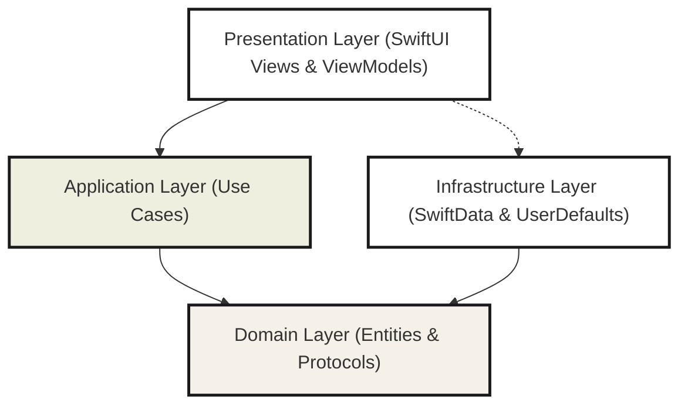

# ⚡️ Streak — iOS Habit Tracker

[](https://developer.apple.com/ios/)
[](https://developer.apple.com/swift/)
[](https://developer.apple.com/xcode/swiftdata/)
[](#-neo-brutalist-design-system)

Streak is a local-first, privacy-respecting iOS habit tracker built with Swift 5.9, SwiftUI, and SwiftData. Distributed via AltStore, it requires no backend, network calls, or user accounts.

<p align="center">
  
</p>

---

## ⚡️ The Core Rules of Consistency

Streak is designed for **extreme accountability**. It enforces a brutal consistency policy:

* **Strict Binary State:** A day is either **Green** (all tasks completed) or **Red** (any task missed, or no tasks scheduled). There are no partial states.
* **Brutal Reset:** Any single Red day immediately resets your streak to `0`. No exceptions.
* **Lockout Rule:** If no tasks are scheduled for the upcoming active day before your custom rollover deadline, the day is permanently locked as Red.

---

## ✨ Features

1. **Habit Categories** – Create custom habit tracks with designated highlight colors, individual heatmaps, and individual streaks.
2. **Master Consistency Graph** – A unified consistency calendar (GitHub-style heatmap) representing overall success across all categories.
3. **Multi-Timeframe Task & To-Do Planning** – Seamlessly plan across **Daily** (Today/Tomorrow), **Weekly Goals**, **Monthly Targets**, and a **Timeline-Free To-Do List** (Backlog reminders).
4. **Quick Task Promotion** – Instantly schedule any Weekly, Monthly, or To-Do list item to Today (`[⚡️ TODAY]`) or Tomorrow (`[🗓️ TOMORROW]`) with one tap.
5. **Daily Habit Commitments & Sprints** – Create locked monthly commitments (`.monthlyFixed`) or custom habit sprints (`.customRange`) that automatically populate as daily checklist items.
6. **Dynamic Light & Dark Neo-Brutalism** – High-contrast design system supporting Light Mode (`#F5F0E8`), Dark Mode (`#121212`), and System automatic theme switching with dynamic `AppColor` tokens.
7. **Soft-Deletion Protection** – Deleted tasks move to the bottom of the list with a strike-through and `(Deleted)` badge without breaking or ruining historical streaks. Second swipe permanently purges.
8. **Game-Style Goals** – Track progress across four goal types (consecutive streaks, cumulative days, milestone progress, and task counters).
9. **Daily Assist** – End-of-day reflection forms to log accomplishments, missed items, and tomorrow's priorities (stored locally).
10. **In-App Reset All Data** – Easily reset all data from Settings (SwiftData entities, App Group widget stores, and UserDefaults).

---

## 🎨 Neo-Brutalist Design System (Light & Dark)

The app utilizes a premium, high-contrast Neo-Brutalist UI spec designed for high readability, physical screen borders, and retro aesthetics.

### Color Palette Tokens

| Name | Light Mode | Dark Mode | Application |
|---|---|---|---|
| **Background** | `#F5F0E8` (Vanilla Paper) | `#121212` (Dark Obsidian) | Application Background Canvas |
| **Surface** | `#EFEFDF` (Muted Sand) | `#1E1E1E` (Dark Surface) | Card Fills & Input Containers |
| **Border / Text** | `#1A1A1A` (Ink Black) | `#F5F0E8` (Vanilla Cream) | 2.5pt High-Contrast Borders & Text |
| **Green** | `#2D7A2D` (Forest Green) | `#34C759` (Vivid Neon Green) | Complete Status Days & Checkboxes |
| **Red** | `#C0392B` (Crimson Red) | `#FF3B30` (Vivid Neon Red) | Incomplete Status Days & Danger Actions |

### Core UI Guidelines
* **Borders:** Every element uses solid, sharp borders (`2.5pt` width, `#1A1A1A` in Light Mode, `#F5F0E8` in Dark Mode).
* **Shadows & Gradients:** Zero. High contrast is achieved through flat, solid fills and clean lines.
* **Layout:** Generous sizing. A minimum tap target size of `44x44pt` is enforced globally.
* **Highlighting:** Category-specific hex codes are used dynamically to tint cards, dots, heatmaps, and progress fills.

---

## 🏗 Architecture & Stack

The codebase follows **Clean Architecture** combined with **Domain-Driven Design (DDD)**, separating code into four distinct layers:



* **Domain Layer:** Pure Swift. Contains entities like `Category`, `Task`, `Goal`, `HabitRoutine`, value objects like `DayStatus`, and repository protocols. Crucially, it imports **zero** UI or database frameworks.
* **Application Layer:** Contains individual, single-responsibility use cases (e.g., `ResolveDayStatusUseCase`, `GenerateRoutineTasksUseCase`, `ResetAllDataUseCase`).
* **Infrastructure Layer:** Implements data persistence via SwiftData and `UserDefaults` (shared App Group suite for widgets).
* **Presentation Layer:** SwiftUI views with `@Observable` state objects and custom Neo-Brutalist styling tokens.

---

## 🛠 Getting Started

### Prerequisites
* Mac running macOS Sonoma or later
* Xcode 15.0+ (Swift 5.9+)
* An iOS 17.0+ Simulator or physical device

### Xcode Project Setup
1. Clone the repository:
   ```bash
   git clone https://github.com/yourusername/streak.git
   ```
2. Open the Xcode workspace:
   ```bash
   cd streak/Streak
   open Streak.xcodeproj
   ```
3. Ensure the active build target is set to **Streak** and select a simulator (e.g. iPhone 17).
4. Run the project (**Command + R**).

> [!TIP]
> The app relies on a shared App Group `group.com.madhvan.streak` to synchronise widget states. Xcode will compile locally out-of-the-box, but you may need to update the Bundle Identifiers and App Group settings under *Signing & Capabilities* if you plan to sideload onto a physical device.

---

## 📚 Technical Documentation Index

Detailed design specs and architectural blueprints are available in the [docs/](docs) folder:

* 📄 [Product Requirements Document (PRD)](docs/PRD.md) – Feature details, business logic, and lockout rules.
* 📄 [Dark Mode & Theme System Specification](docs/DARK_MODE_SPEC.md) – Light & Dark Neo-Brutalist color tokens, trait collection rules, and widget theme resolution.
* 📄 [Architecture Specification](docs/ARCHITECTURE.md) – Dependency injection patterns, SOLID rules, and layer organization.
* 📄 [High-Level Design (HLD)](docs/HLD.md) – App screen maps, data-flow diagrams, and background worker systems.
* 📄 [UI/UX Specification](docs/UI_UX_SPEC.md) – Comprehensive guidelines for color, typography, custom components, and layout.
* 📄 [Data Models Guide](docs/DATA_MODELS.md) – Database schema schemas, business validation rules, and export formats.
* 📄 [iOS Integrations](docs/IOS_INTEGRATIONS.md) – Details on WidgetKit, App Intents, local notifications, and iCloud.
* 📄 [Hosting & sideloading](docs/HOSTING.md) – Build pipeline, AltStore publishing instructions, and signing setups.
* 📄 [Active Day Cycle Fix Notes](docs/ACTIVE_DAY_CYCLE_FIX.md) – Details of the custom date rollover repair and same-day scheduling validation.
