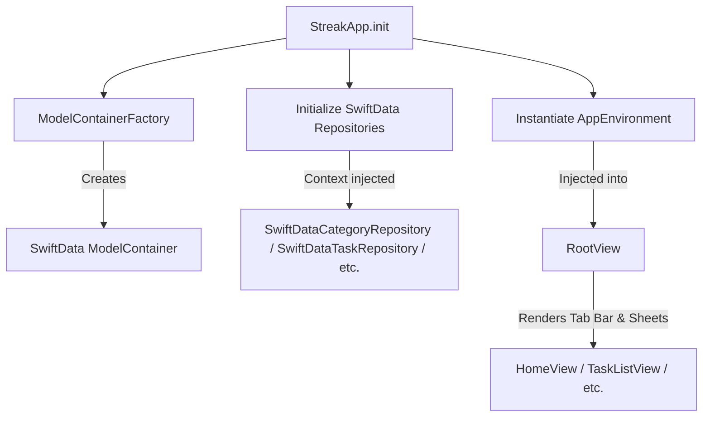

# App Core Architecture

This module explains the core components that initialize the application, handle dependency injection, manage navigation state, and orchestrate top-level layouts.

---

## Code Units

### 1. `StreakApp`
- **File Path:** [StreakApp.swift](file:///Users/madhvan07icloud.coom/self-improvment-app/Streak/Streak/StreakApp.swift)
- **Type:** `@main struct`
- **Responsibility:** The main entry point of the iOS application. Wires the local database ModelContainer, instantiates repositories, sets up the dependency injection container, and injects state objects into the SwiftUI environment.
- **Key Methods:**
  - `init()`: Initializes the SwiftData store, instantiates repositories, and configures the `AppEnvironment` container.
  - `body`: Defines the main `WindowGroup` scene and wires the `RootView` with global environments. Handles widget sync on launch and deep-linking URLs via `onOpenURL` (e.g. from iOS widgets).

---

### 2. `AppEnvironment`
- **File Path:** [AppEnvironment.swift](file:///Users/madhvan07icloud.coom/self-improvment-app/Streak/Streak/App/AppEnvironment.swift)
- **Type:** `@Observable class`
- **Responsibility:** Serves as a lightweight Dependency Injection (DI) container. Exposes active repository protocols to ViewModels. ViewModels fetch this environment from the view hierarchy.
- **Properties:**
  - `categoryRepository`: Repository interface for categories.
  - `taskRepository`: Repository interface for tasks.
  - `goalRepository`: Repository interface for goals.
  - `dayEntryRepository`: Repository interface for day completions.
  - `reflectionRepository`: Repository interface for daily reflections.
- **Key Methods:**
  - `syncWidgets()`: Triggers the `SyncWidgetDataUseCase` to update shared user default snapshots in the shared App Group container, notifying widgets to reload.

---

### 3. `AppRouter`
- **File Path:** [AppRouter.swift](file:///Users/madhvan07icloud.coom/self-improvment-app/Streak/Streak/App/AppRouter.swift)
- **Type:** `@Observable class`
- **Responsibility:** Manages global navigation state across the application, driving tab selection, sheet presentations, and detail view stack destinations.
- **Enums:**
  - `Tab`: Represents bottom tab bar destinations (`.home`, `.tasks`, `.goals`, `.more`).
  - `Sheet`: Identifies presentable sheets with parameter payloads (e.g. `.editCategory(UUID)`, `.addTask(Date)`, `.dailyAssist(Date)`).
- **Key State Properties:**
  - `selectedTab`: The active bottom tab.
  - `activeSheet`: The currently presented sheet, if any.
  - `categoryDetailId`: A UUID pointing to the category detail screen destination when pushed.
  - `goalDetailId`: A UUID pointing to the goal detail screen destination when pushed.
- **Navigation Controls:**
  - `present(_:)` / `dismiss()`: Presents or clears sheet modally.
  - `showCategoryDetail(_:)` / `showGoalDetail(_:)`: Pushes detail views onto navigation stacks.

---

### 4. `RootView`
- **File Path:** [RootView.swift](file:///Users/madhvan07icloud.coom/self-improvment-app/Streak/Streak/Presentation/RootView.swift)
- **Type:** `View struct`
- **Responsibility:** Renders the master tab hierarchy and captures modal presentation requests. Configures appearance tokens for system components (e.g. the standard `UITabBarAppearance` overrides for Neo-Brutalist styling).
- **Key Components:**
  - `TabView`: Binds `selectedTab` to render the appropriate home screen or checklist.
  - `sheet(item:)`: Intercepts `activeSheet` changes to present views like `AddCategoryView` modally.

---

## Data Flow: App Initialization

